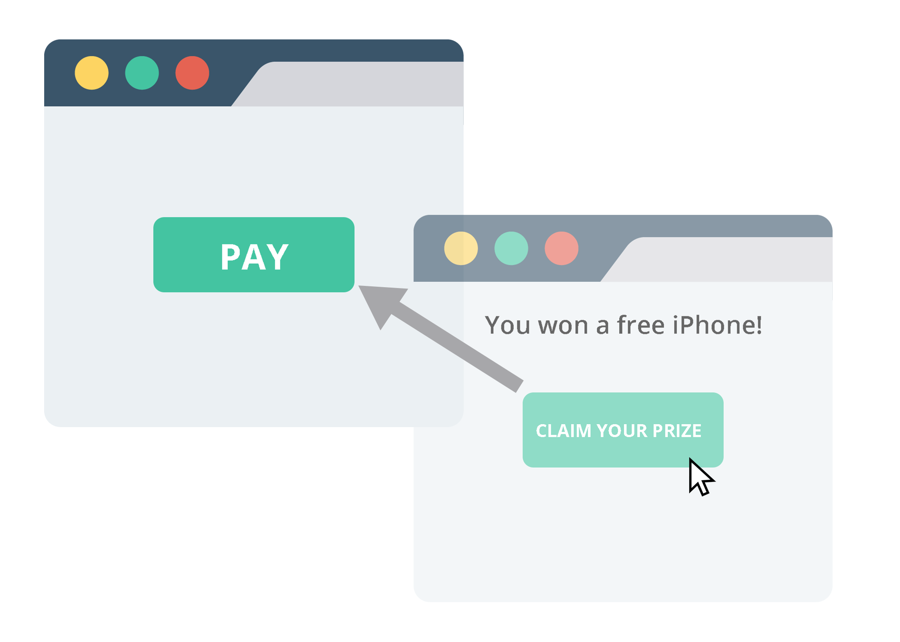

## Install
`git clone https://github.com/ismail4567/clickjacking-script.git`
## Usage 
`cd clickjacking-script`  
`chmod +x clickjacking_test.sh`  
`./clickjacking_test.sh`  
## Clickjacking
Clickjacking is an attack that tricks a user into clicking a webpage element which is invisible or disguised as another element. This can cause users to unwittingly download malware, visit malicious web pages, provide credentials or sensitive information, transfer money, or purchase products online

> [!CAUTION]
>   **This is only for education purpose only. How use this is your responsibilty. I will not be held accountable for any illegal activities**

***Enjoy it...***
